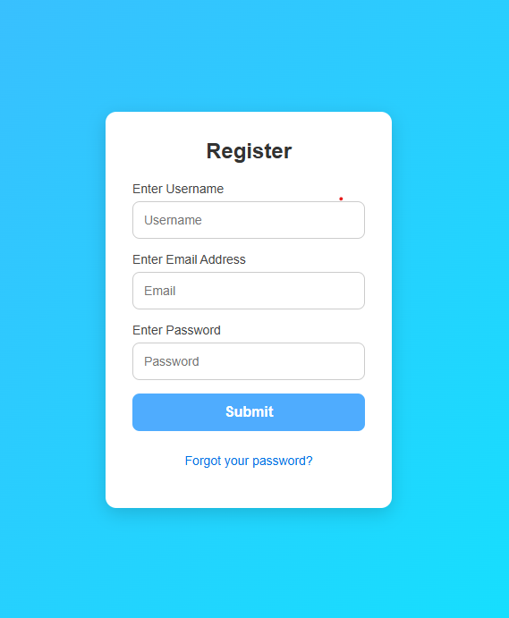
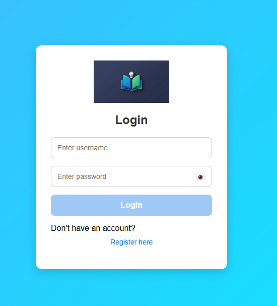
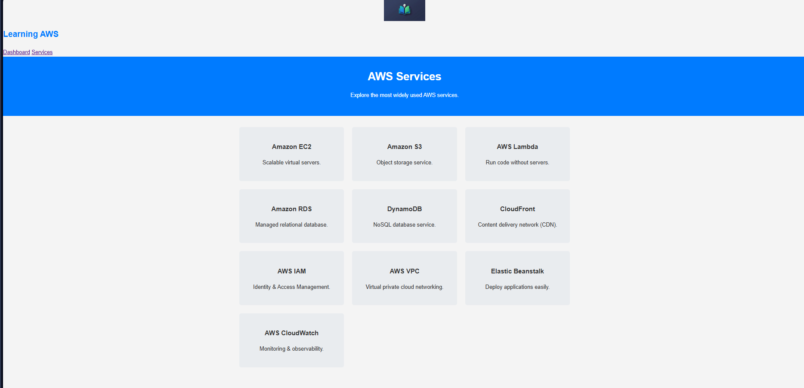
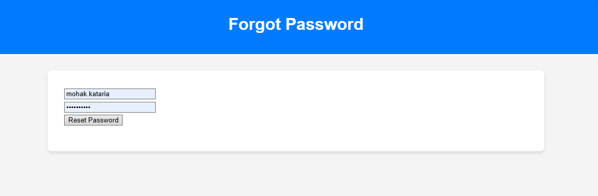
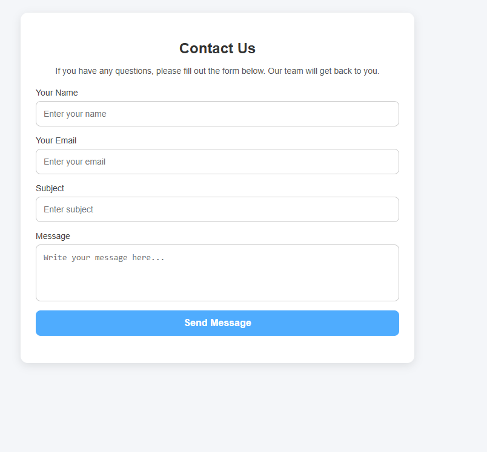

# AWS Password-Based Authentication Project

This project demonstrates a simple password-based authentication system hosted on AWS.

## Project Overview
- Frontend: HTML, CSS, JavaScript
- Backend: AWS Lambda functions exposed via API Gateway
- Functionality: Users enter credentials on the frontend, which are validated via AWS Lambda
- Purpose: Learn and demonstrate authentication using AWS services

## How It Works
1. User inputs credentials on the frontend.
2. JavaScript sends the input data to AWS API Gateway.
3. API Gateway triggers the relevant AWS Lambda function.
4. Lambda validates the credentials and returns the response.
5. Frontend displays authentication success or failure.

## Screenshots
Register Page:

Login Page:

CloudTech Dashboard:

Services:

Forgot Password:

Contact:

## Future Enhancements
- Add OAuth or multi-factor authentication
- Connect with a database to store credentials securely
